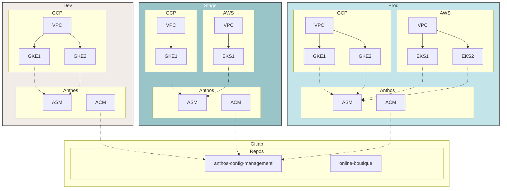
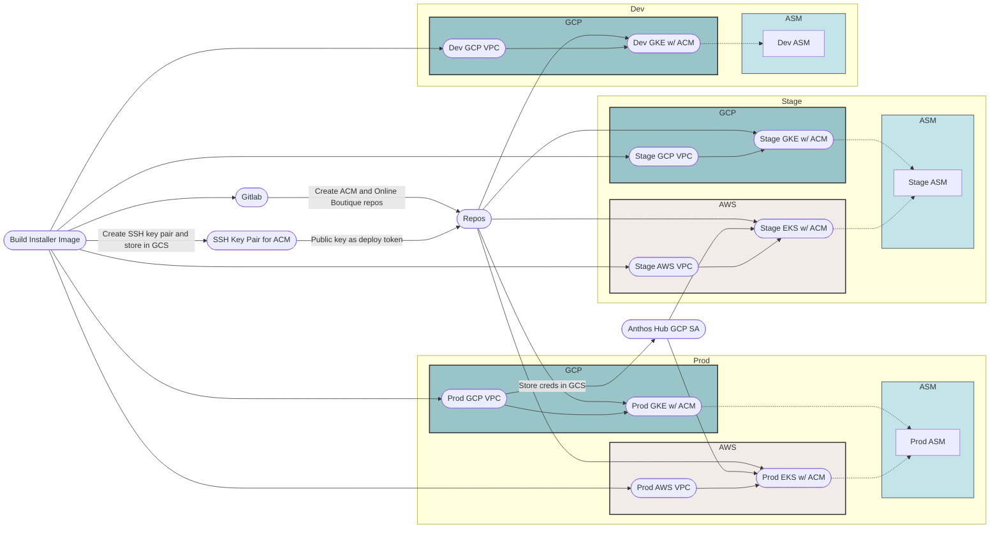
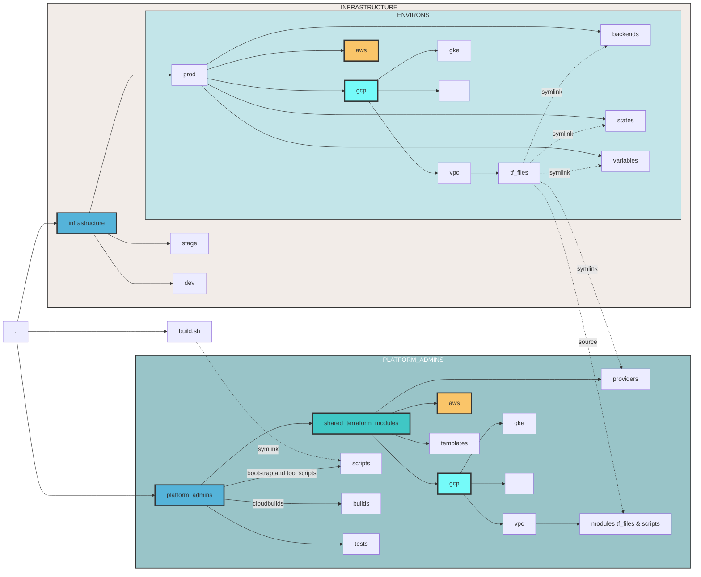

# Anthos Multicloud with attached clusters - GKE and EKS Edition

## Architecture


## Objectives

In this workshop you will accomplish the following:

- Setting up an Anthos multicloud environment on GCP and AWS using GKE and EKS anthos attached clusters (registered via GKE Hub).
- Deploying Anthos Config Management (ACM) and Anthos Service Mesh (ASM) on both clusters.
- Deploying Online Boutique application on both clusters.
- Setting up monitoring and observability via Cloud Monitoring.
- Setting up global load balancing via GCLB to send client traffic (and loadgenerator traffic) to both instances on the Online Boutique app running in GKE and EKS (serving use case)
- Deploying Bank of Anthos on EKS cluster.
- Using Anthos to reliably migrate Bank of Anthos from AWS (EKS) to GCP (GKE).

## Setting up the environment in Qwiklabs

This workshop is intended to be run in Qwiklabs. 

You should see two labs in Qwiklabs as part of this workshop. One of the labs sets up an environment (a clean GCP project) in GCP while the other sets up an environment in AWS (a federated qwiklabs managed account).  Starting both of these labs provide you with credentials to both environments. For GCP, you get a Google account username, password and a GCP project. You use these credentials to access and administer resources in your provided GCP project via GCP Console and Cloud Shell. For AWS, you get an Access Key ID and a Secret Access Key. These credentials allow you full control over both environments. These two environments are temporary and expire at the end of this workshop (or when time expires). If you would like a persistent setup of this workshop, you can follow the same instructions using your own GCP and AWS accounts.

## Setup

In Qwiklabs, you should see two labs. One lab starts the GCP environment, and the other starts the AWS environment.

- Start both lab environments. Starting the two labs will give you credentials to both GCP and AWS environments.
- From the GCP lab, open Cloud Shell. This lab is intended to be run from Cloud Shell.
```
ssh.cloud.google.com
```
- Set GCP and AWS credentials. Get the value of the GCP Project ID, AWS Access Key ID and AWS Secret Access
  Key from Qwiklabs and replace the values with your values below.
```
export GOOGLE_PROJECT=[GCP PROJECT ID]
export AWS_ACCESS_KEY_ID=[AWS_ACCESS_KEY_ID]
export AWS_SECRET_ACCESS_KEY=[AWS_SECRET_ACCESS_KEY]
export ASM_VERSION=1.6.8-asm.9
```

- Create a `WORKDIR` for this tutorial. All files related to this tutorial end up in `WORKDIR`.
```
mkdir -p $HOME/anthos-multicloud && cd $HOME/anthos-multicloud && export WORKDIR=$HOME/anthos-multicloud
```
- Clone the workshop repo.
```
git clone https://gitlab.com/ameer00/anthos-multicloud-workshop.git ${WORKDIR}/attached-clusters
```

## Deploy the environment

- Run the bootstrap script to set up the environment in GCP and AWS.
```
cd ${WORKDIR}/attached-clusters
./build.sh
```
- Once the `build.sh` script finishes, it triggers an infrastructure deployment pipeline in **Cloudbuild**. This pipeline deploys the Anthos platform in both GCP and AWS.

> Note that the infrastructure pipeline can take 40 - 50 minutes to complete.

- Go to the **Cloudbuild** details page in Cloud Console from the left hand navbar.
- You see one build running. Click on the build ID to inspect the stages of the pipeline.

## Infrastructure Pipeline


## Folder Structure

