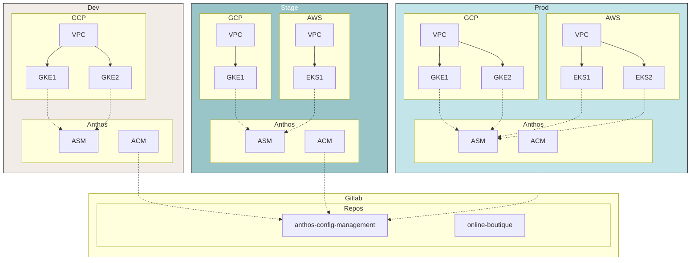
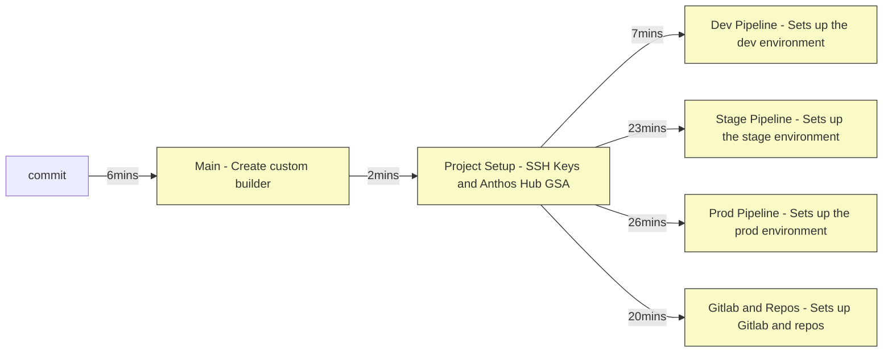

# Anthos Multicloud Workshop

[[_TOC_]]

## Architecture



## Objectives

In this workshop you will accomplish the following:

- Setting up an Anthos multi-environment multicloud environment on GCP and AWS using GKE and EKS anthos attached clusters (registered via GKE Hub).
- Setting up VPCs in each environment in GCP and VPC.
- Setting up GKE and EKS clusters in GCP and AWS.
- Deploying Anthos Config Management (ACM) on all clusters.
- Setting up a local Gitlab for source code management (SCM) with repos.
- Creating multicloud service meshes per environment using Anthos Service Mesh (ASM)
- Showcase distributed services and service migration between clouds.

## Setting up the environment in Qwiklabs

This workshop is intended to be run in Qwiklabs.

You should see two labs in Qwiklabs as part of this workshop. One of the labs sets up an environment in GCP (a clean GCP project) and the other sets up an environment in AWS (a federated qwiklabs managed account). Starting both of these labs provide you with credentials to both environments.

For GCP, you get a Google account username, password and a GCP project. You use these credentials to access and administer resources in your provided GCP project via GCP Console and Cloud Shell.

For AWS, you get an Access Key ID and a Secret Access Key. These credentials allow you full control over both environments.

These two environments are temporary and expire at the end of this workshop (or when time expires). If you would like a persistent setup of this workshop, you can follow the same instructions using your own GCP and AWS accounts.

## Setup

In Qwiklabs, you should see two labs. One lab starts the GCP environment, and the other starts the AWS environment.

- Start both lab environments. Starting the two labs will give you credentials to both GCP and AWS environments.
- From the GCP lab, open Cloud Shell. This lab is intended to be run from Cloud Shell.

```
ssh.cloud.google.com
```

- Set GCP and AWS credentials. Get the value of the GCP Project ID, AWS Access Key ID and AWS Secret Access
  Key from Qwiklabs and replace the values with your values below.

```
export GOOGLE_PROJECT=[GCP PROJECT ID]
export AWS_ACCESS_KEY_ID=[AWS_ACCESS_KEY_ID]
export AWS_SECRET_ACCESS_KEY=[AWS_SECRET_ACCESS_KEY]
```

- Create a `WORKDIR` for this tutorial. All files related to this tutorial end up in `WORKDIR`.

```
mkdir -p $HOME/anthos-multicloud && cd $HOME/anthos-multicloud && export WORKDIR=$HOME/anthos-multicloud
```

- Clone the workshop repo.

```
git clone https://gitlab.com/ameer00/anthos-multicloud-workshop.git ${WORKDIR}/anthos-multicloud-workshop
```

## Deploying the environment

- Run the `build.sh` script from the root folder to set up the environment in GCP and AWS. The `build.sh` script installs the required tools in Cloud Shell and triggers a _cloudbuild_ job which creates a number of resources in both GCP and AWS.

```
cd ${WORKDIR}/anthos-multicloud-workshop
./build.sh
```

- The `build.sh` script creates an `infrastructure` repo in Cloud Source Repository (CSR). The `infrastructiure` repo contains the code to deploy the Anthos resources in GCP and AWS. Commiting to the _master_ branch of the `infrastructure` repository triggers a series of build pipelines in **Cloudbuild**. These pipelines deploys the Anthos platform resources in both GCP and AWS.
  > Note that the infrastructure build process can take approximately 30 - 35 minutes to complete.
- After the `build.sh` script finishes, navigate to the **Cloudbuild** details page in Cloud Console from the left hand navbar.
- Initially, you see the `main` build running. Click on the build ID to inspect the stages of the pipeline. The `main` build pipeline trigger additional builds.
- The following diagram illustrates the builds and the approximate times each stage takes to complete. Note that all the `env` and the `gitlab` stages run concurrently as shown.



- You can trigger this pipeline by running the `build.sh` script which commits the changes to the `infrastructure` CSR repo's _master_ branch.
- Alternatively, you can directly commit changes to the `infrastructure` repo which is cloned in the `${WORKDIR}/infra-repo` folder in Cloud Shell.
  > Running the `build.sh` script overrides any changes you make locally through the `infra-repo` folder.

## Infrastructure Pipeline

The following illustration provides a detailed view of the pipelines and the resources that are created.


## User setup
- Verify that all pipelines finish successfully. 
```bash
gcloud builds list
```
_OUTPUT (Do not copy)_
```bash
ID                                    CREATE_TIME                DURATION  SOURCE                                                                                                      IMAGES  STATUS
ca7c4cd3-cd26-46ab-b1ba-49d93e80d567  2020-09-11T21:23:49+00:00  24M23S    gs://qwiklabs-gcp-02-3d346cf87fd8_cloudbuild/source/1599859427.742461-84b48dc9b6c94fe1b1d9f4f3c490f635.tgz  -       SUCCESS
a04832fd-df8a-4533-9307-ff5ee39e813d  2020-09-11T21:23:48+00:00  17M50S    gs://qwiklabs-gcp-02-3d346cf87fd8_cloudbuild/source/1599859427.061173-61bcedfeae134da7b4783afde66a3ead.tgz  -       SUCCESS
52712167-d29f-47f9-b6bc-f530efac3bee  2020-09-11T21:23:47+00:00  22M9S     gs://qwiklabs-gcp-02-3d346cf87fd8_cloudbuild/source/1599859425.499421-2e5ee25907124f02b0822ee12f3d03e2.tgz  -       SUCCESS
4a7d7686-46a3-440a-af46-1be607205b16  2020-09-11T21:23:46+00:00  6M53S     gs://qwiklabs-gcp-02-3d346cf87fd8_cloudbuild/source/1599859425.402949-c875d1b65f7a49dcacde5d766fe7ac62.tgz  -       SUCCESS
1aeab461-7b31-4ae3-bfac-9700c18f9819  2020-09-11T21:21:37+00:00  2M3S      gs://qwiklabs-gcp-02-3d346cf87fd8_cloudbuild/source/1599859295.678195-ef981107e3e3465daa3d54a54a9c7f05.tgz  -       SUCCESS
ed662a31-cc37-4411-9eb3-87425757557a  2020-09-11T21:17:48+00:00  6M2S      infrastructure@bba1e6558c8da62e211870a09c9fb05594687081                                                     -       SUCCESS
```

- Run the `user_setup.sh` script from the repository root folder.
```bash
source ${HOME}/.bashrc # If you're using ZSH, source ${HOME}/.zshrc
cd ${WORKDIR}/anthos-multicloud-workshop
source ./user_setup.sh
```

- This `user_setup.sh` script performs the following steps:
  - Downloads EKS cluster _kubeconfig_ files. The location of these files is in the `${WORKDIR}/kubeconfig` folder.
  - Downloads SSH-Key pair. SSH Keys are used to interact with Gitlab repos. The location of these files is in the `${WORKDIR}/ssh-keys` folder.
  - Downloads the Gitlab hostname and root password txt file. The location of the file is in the `${WORKDIR}/gitlab` folder.
  - Creates a combined _kubeconfig_ file with all cluster contexts. Renames the clusters for easy context switching. The location of the merged _kubeconfig_ file is `${WORKDIR}/kubeconfig/workshop-config`. The script also sets this as your `KUBECONFIG` variable.
  - Get the EKS cluster's Kubernetes Service Account tokens to login to through the Cloud Console. Learn about logging in to Anthos registered clusters [here](https://cloud.google.com/anthos/multicluster-management/console/logging-in).
> The script is idempotent and can be run multiple times.

_OUTPUT from the `user_setup.sh` script (Do not copy)_
```bash
*** eks-prod-us-west2ab-1 Token ***

[EKS Cluster Token]

*** eks-prod-us-west2ab-2 Token ***

[EKS Cluster Token]

*** eks-stage-us-east1ab-1 Token ***

[EKS Cluster Token]

*** Gitlab Hostname and root password ***

gitlab.endpoints.PROJECT_ID.cloud.goog
[`root` PASSWORD]

```

