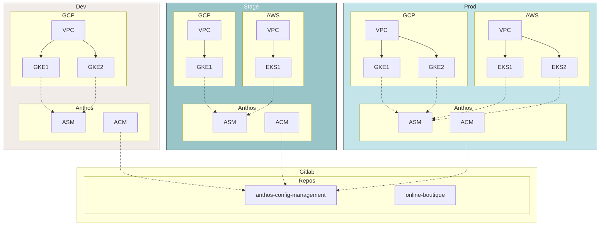
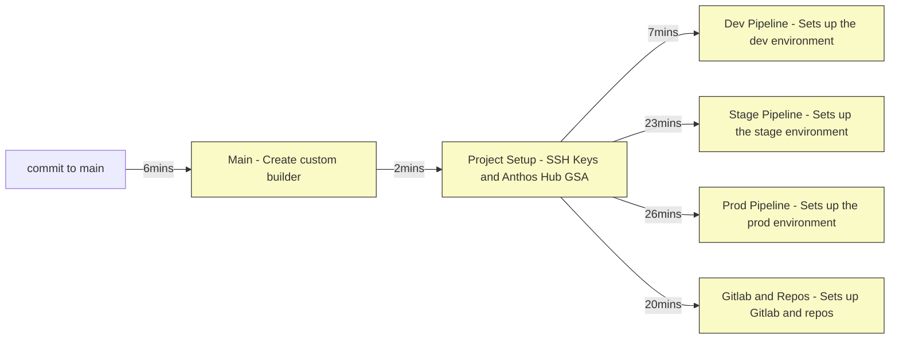
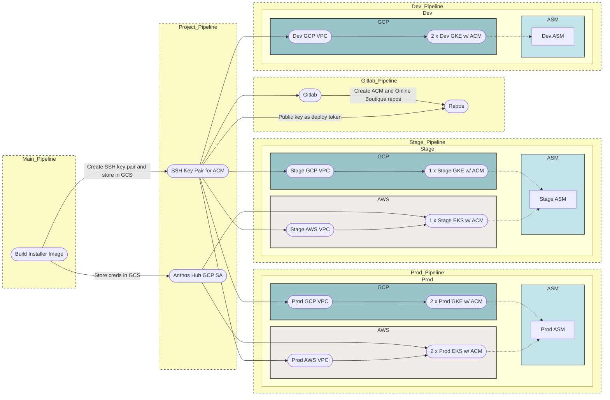

# Anthos Multicloud Workshop

[[_TOC_]]

## Architecture



## Introduction to Anthos

[Anthos](https://cloud.google.com/anthos) is a hybrid and multi-cloud platform that allows enterprises to build, deliver and manage the life cycle of modern applications in a fast, scalable, reliable and secure way. In addition to [modern applications](https://cloud.google.com/solutions/cloud-native-app-development), Anthos also integrates to existing applications and application infrastructure which allows enterprises to modernize in place, in the cloud and at their own pace. Anthos platform is cloud agnostic. It can run in an on-premises data center, GCP or any cloud environment. Anthos platform is composed of a number of components that provide the following functionality:

- Container management (via [Anthos GKE](https://cloud.google.com/anthos/gke) or [Anthos attached clusters](https://cloud.google.com/anthos/docs/setup/attached-clusters))
- Policy management and enforcement (via [Anthos Configuration Management](https://cloud.google.com/anthos/config-management))
- Services management (via [Anthos Service Mesh](https://cloud.google.com/anthos/service-mesh))
- Application and software life cycle management ([CI/CD](https://cloud.google.com/solutions/modern-ci-cd-with-anthos))
- Observability and platform management (via [Cloud Operations](https://cloud.google.com/products/operations))

## About the workshop

The purpose of this workshop is to learn, build and manage Anthos platform in a multi-cloud environment. Instead of a technology (or product) focused approach, the workshop takes a persona-focused approach. Each lab in the workshop addresses a user journey or story. There are three main personae that interact with Anthos:

1. **Application Developers or Owners** - Application developers are primarily responsible for writing and debugging application code.
1. **Application or Service Operators** - Also sometimes affectionately known as [SRE](https://landing.google.com/sre/), are responsible for running applications/services, monitoring the health and status of live deployments, and rolling out updates.
1. **Platform Administrators** - Platform admins are part of a centralized platform team responsible for creating and managing resources for application teams and managing the organization’s central infrastructure.

The labs in the workshops are designed with these user personae and their user journeys in mind.

The workshop is divided into two main sections:

1. [**Foundation**](/README.md#foundation) - Aimed at the platform admin persona, the foundation focuses on _building_ the Anthos platform. The foundation goes through tooling, build pipelines, automation, best practices and management of components of Anthos in GCP and AWS. The foundation covers a canonical approach of building and managing Anthos platform in a multi-cloud environment.
1. [**User Stories**](/README.md#labs) - After the foundation, different personae can start _using_ the Anthos platform. This section is a series of labs that go through various user stories. The labs in this section are designed to be iterative and ever growing. The idea behind splitting the foundation from the user stories is so that anyone can build upon the foundation for a particular story. We will continue to add more stories (i.e. labs) in time and as we hear more use cases. Examples of user stories that are part of this workshop are as follows:

- _I, application owner and operator, want to deploy my applications across multiple clusters in multiple cloud environments_
- _I, application operator, want to move/migrate services between clusters in a multi-cloud environment._
- _I, application owner and operator, want to run the same service in multiple cluster and in multiple cloud environments._
- _I, application operator, want to use Cloud Monitoring to monitor metrics from all services running in all clusters in multiple cloud environments_
- _I, platform administrator, want to add a new cluster to my multi-cloud environment_

## Foundation - Building Anthos platform

To set up the Anthos platform foundation, you accomplish the following:

- Setting up an Anthos multi-environment multicloud environment on GCP and AWS using GKE and EKS anthos attached clusters (registered via GKE Hub).
- Setting up VPCs in each environment in GCP and VPC.
- Setting up GKE and EKS clusters in GCP and AWS.
- Deploying Anthos Config Management (ACM) on all clusters.
- Setting up a local Gitlab for source code management (SCM) with repos.
- Creating multicloud service meshes per environment using Anthos Service Mesh (ASM)

## Setting up the environment in Qwiklabs

This workshop is intended to be run in [Qwiklabs](https://explore.qwiklabs.com). You should have been invited to a Qwiklabs "Classroom". In the "Classrooms" icon on the left of the home screen, navigate to the 'Anthos Multicloud Workshop GCP' classroom.

You will now see two labs in Qwiklabs as part of this workshop. One of the labs sets up an environment in GCP (a clean GCP project) and the other sets up an environment in AWS (a federated qwiklabs managed account). Starting both of these labs provide you with credentials to both environments.

For GCP, you get a Google account username, password and a GCP project. You use these credentials to access and administer resources in your provided GCP project via GCP Console and Cloud Shell.

- Tip: You can open an incognito window in Chrome to log in as this temporary user, without having to deal with switching Google accounts.
- Once you log in using the user/pass in the qwiklab window, you should see the GCP console, logged into project: `qwiklabs-gcp-1234abcd`
- You should also see at the top right that you're logged in as a User, like: `student-00-1234abcd@qwiklabs.net`

For AWS, you get an Access Key ID and a Secret Access Key. These credentials allow you full control over both environments.

- Tip: Don't try to open this in the incognito window. Instead, just click the "Open Console" button.
- On the first try, this will fail :( -- it is creating your credentials and you'll see a banner: `Creating login credentials. Please try again in 30 seconds.`
- Try again, and you should be logged into https://console.aws.amazon.com/console/home?region=us-east-1#
- You should see that you're logged in at the top right: `awsstudent @ [1234-1234-1234]`

These two environments are temporary and expire at the end of this workshop (or when time expires). If you would like a persistent setup of this workshop, you can follow the same instructions using your own GCP and AWS accounts.

## Setup

In Qwiklabs, you should see two labs. One lab starts the GCP environment, and the other starts the AWS environment.

- Start both lab environments. Starting the two labs will give you credentials to both GCP and AWS environments.
- From the GCP lab, open Cloud Shell. This lab is intended to be run from Cloud Shell.

```
ssh.cloud.google.com
```

- Set GCP and AWS credentials. Get the value of the GCP Project ID, AWS Access Key ID and AWS Secret Access
  Key from Qwiklabs and replace the values with your values below.

```
export GOOGLE_PROJECT=[GCP PROJECT ID] # example export GOOGLE_PROJECT=qwiklabs-gcp-1234abcd
export AWS_ACCESS_KEY_ID=[AWS_ACCESS_KEY_ID] # example export AWS_ACCESS_KEY_ID=ABCDEF123456
export AWS_SECRET_ACCESS_KEY=[AWS_SECRET_ACCESS_KEY] # example export AWS_SECRET_ACCESS_KEY=123abc456def789def
```

- Create a `WORKDIR` for this tutorial. All files related to this tutorial end up in `WORKDIR`.

```
mkdir -p $HOME/anthos-multicloud && cd $HOME/anthos-multicloud && export WORKDIR=$HOME/anthos-multicloud
```

- Clone the workshop repo.

```
git clone https://gitlab.com/anthos-multicloud/anthos-multicloud-workshop.git ${WORKDIR}/anthos-multicloud-workshop
```

## Deploying the environment

- Run the `build.sh` script from the root folder to set up the environment in GCP and AWS. The `build.sh` script runs the [`bootstrap.sh`](platform_admins/scripts/bootstrap.sh) script, for more information about the script see the [bootstrap.sh documentations](platform_admins/docs/scripts.md#bootstrapsh)

```
cd ${WORKDIR}/anthos-multicloud-workshop
gcloud config set project ${GOOGLE_PROJECT}

gcloud auth login
<Enter verification code>

gcloud auth list
<Authorize gcloud>

./build.sh
```

> Note that the infrastructure build process can take approximately 30 - 35 minutes to complete.

- After the `build.sh` script finishes, navigate to the **Cloudbuild** details page in Cloud Console from the left hand navbar.
- Initially, you see the `main` build running. Click on the build ID to inspect the stages of the pipeline. The `main` build pipeline trigger additional builds.
- The following diagram illustrates the builds and the approximate times each stage takes to complete. Note that all the `env` and the `gitlab` stages run concurrently as shown.



- You can trigger this pipeline by running the `build.sh` script which commits the changes to the `infrastructure` CSR repo's _main_ branch.
- Alternatively, you can directly commit changes to the `infrastructure` repo which is cloned in the `${WORKDIR}/infra-repo` folder in Cloud Shell.
  > Running the `build.sh` script overrides any changes you make locally through the `infra-repo` folder.

## Infrastructure Pipeline

The following illustration provides a detailed view of the pipelines and the resources that are created.



## User setup

- Verify that all pipelines finish successfully.

```bash
gcloud builds list
```

optional: follow progress of builds with

```bash
watch -n 10 gcloud builds list
```

_OUTPUT (Do not copy)_

```bash
ID                                    CREATE_TIME                DURATION  SOURCE                                                                                                      IMAGES  STATUS
ca7c4cd3-cd26-46ab-b1ba-49d93e80d567  2020-09-11T21:23:49+00:00  24M23S    gs://qwiklabs-gcp-02-3d346cf87fd8_cloudbuild/source/1599859427.742461-84b48dc9b6c94fe1b1d9f4f3c490f635.tgz  -       SUCCESS
a04832fd-df8a-4533-9307-ff5ee39e813d  2020-09-11T21:23:48+00:00  17M50S    gs://qwiklabs-gcp-02-3d346cf87fd8_cloudbuild/source/1599859427.061173-61bcedfeae134da7b4783afde66a3ead.tgz  -       SUCCESS
52712167-d29f-47f9-b6bc-f530efac3bee  2020-09-11T21:23:47+00:00  22M9S     gs://qwiklabs-gcp-02-3d346cf87fd8_cloudbuild/source/1599859425.499421-2e5ee25907124f02b0822ee12f3d03e2.tgz  -       SUCCESS
4a7d7686-46a3-440a-af46-1be607205b16  2020-09-11T21:23:46+00:00  6M53S     gs://qwiklabs-gcp-02-3d346cf87fd8_cloudbuild/source/1599859425.402949-c875d1b65f7a49dcacde5d766fe7ac62.tgz  -       SUCCESS
1aeab461-7b31-4ae3-bfac-9700c18f9819  2020-09-11T21:21:37+00:00  2M3S      gs://qwiklabs-gcp-02-3d346cf87fd8_cloudbuild/source/1599859295.678195-ef981107e3e3465daa3d54a54a9c7f05.tgz  -       SUCCESS
ed662a31-cc37-4411-9eb3-87425757557a  2020-09-11T21:17:48+00:00  6M2S      infrastructure@bba1e6558c8da62e211870a09c9fb05594687081                                                     -       SUCCESS
```

- You can also view this through the **Cloudbuild** page in Cloud Console.


- Run the `user_setup.sh` script from the repository root folder.

```bash
source ${HOME}/.bashrc # If you're using ZSH, source ${HOME}/.zshrc
cd ${WORKDIR}/anthos-multicloud-workshop
source ./user_setup.sh
```

- This `user_setup.sh` script performs the following steps:
  - Downloads EKS cluster _kubeconfig_ files. The location of these files is in the `${WORKDIR}/kubeconfig` folder.
  - Downloads SSH-Key pair. SSH Keys are used to interact with Gitlab repos. The location of these files is in the `${WORKDIR}/ssh-keys` folder.
  - Downloads the Gitlab hostname and root password txt file. The location of the file is in the `${WORKDIR}/gitlab` folder.
  - Creates a combined _kubeconfig_ file with all cluster contexts. Renames the clusters for easy context switching. The location of the merged _kubeconfig_ file is `${WORKDIR}/kubeconfig/workshop-config`. The script also sets this as your `KUBECONFIG` variable.
  - Get the EKS cluster's Kubernetes Service Account tokens to login to through the Cloud Console. Learn about logging in to Anthos registered clusters [here](https://cloud.google.com/anthos/multicluster-management/console/logging-in).
    > The script is idempotent and can be run multiple times.

_OUTPUT from the `user_setup.sh` script (Do not copy)_

```bash
*** eks-prod-us-west2ab-1 Token ***

[EKS Cluster Token]

*** eks-prod-us-west2ab-2 Token ***

[EKS Cluster Token]

*** eks-stage-us-east1ab-1 Token ***

[EKS Cluster Token]

*** Gitlab Hostname and root password ***

gitlab.endpoints.PROJECT_ID.cloud.goog
[`root` PASSWORD]
```

### Variables

The initial `build.sh` script creates a `vars.sh` file in the `${WORKDIR}` folder. The `user_setup.sh` script adds additional variables for the workshop to the `vars.sh` file. The `vars.sh` file is automatically sourced when you log in to Cloud Shell. You can also manually source the file.

### Logging in to EKS clusters

There are three EKS clusters in the architecture. Two clusters in the `prod` environment and one in the `stage` environment. The tokens from the `user_setup.sh` script can be used to log in to the EKS clusters in Cloud Console.

- Navigate to the **Kubernetes Engine > Clusters** page in Cloud Console. You can see the three EKS clusters registered. They have not been logged in.


- Click **Login** next to each EKS cluster and select **Token**. Copy and paste the tokens (outputted from the `user_setup.sh` script) to the EKS clusters.
- Note: Simply select the token in the cloud shell (and nothing else, this automatically copies is), and paste it into the token box in the Cloud Console without intermittently storing it into a file. Any intermittent storage might add extra characters that will invalidate the token and login will fail.


- Navigate to the **Workloads** and **Services** pages and verify you can see metadata information from the EKS clusters. This confirms you have successfully logged in.


### Logging in to Gitlab

Log in to Gitlab.

- Navigate to the output link of the following command.

```bash
echo -e "https://gitlab.endpoints.${GOOGLE_PROJECT}.cloud.goog"
```

- Log in with the username `root` and the gitlab password from the `user_setup.sh` script.
- You see two projects (or repos).
  - `anthos-config-management` - ACM repo
  - `online-boutique` - Online Boutique application repo


## Labs

With the setup complete, you can proceed with the following labs.

#### [Lab 1: Multicloud Applications](/platform_admins/docs/multicluster-networking.md)

> "I, application owner or operator, want to deploy my applications across multiple clusters in multiple cloud environments"

#### [Lab 2: Multicloud Service Portability](/platform_admins/docs/app-migration.md)

> "I, application operator, want to move/migrate services between clusters in a multicloud environment."

#### [Lab 3: Introduction to Distributed Services](/platform_admins/docs/distributed-service-intro.md)

> "I, application owner or operator, want to run the same service in multiple cluster and in multiple cloud environments."

#### [Lab 4: Cloud Monitoring Setup](/platform_admins/docs/cloud-mon-setup.md)

> "I, application operator, want to use Cloud Monitoring to monitor metrics from all services running in all clusters in multiple cloud environments"

#### [Lab 5: Add a New Cluster](/platform_admins/docs/add-cluster.md)

> "I, platform administrator, want to add a new cluster to my multi-cloud environment"
