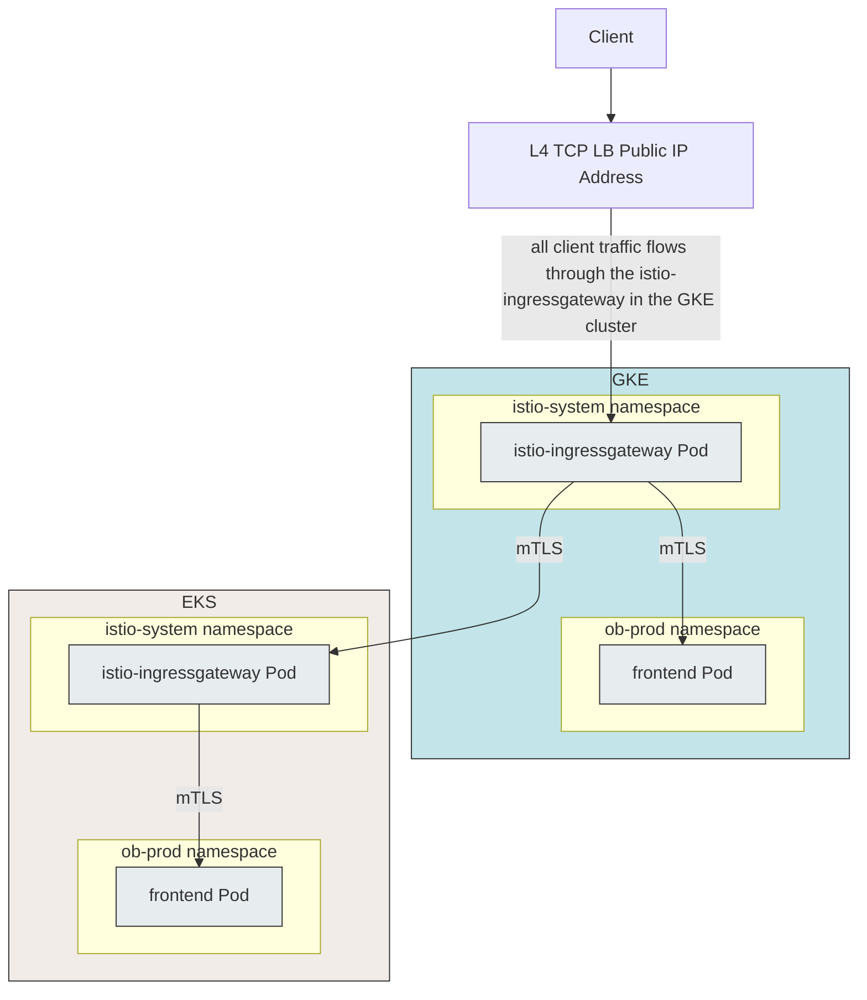

## Objective

1. Deploy a [Distributed Service](https://medium.com/google-cloud/gke-multi-cluster-life-cycle-management-series-b0d39080ac6b) to multiple clusters in multiple cloud environments.

## Prerequisites

1. Follow the steps in the [Lab 1: Multicloud Applications](/platform_admins/docs/multicluster-networking.md) before proceeding.
1. Afterwards, you should be able to access the Online Boutique application.

## Deploying a distributed service on GCP and AWS

A [Distributed Service](https://medium.com/google-cloud/gke-multi-cluster-life-cycle-management-series-b0d39080ac6b) is a stateless Kubernetes Service running on multiple Kubernetes clusters. A distributed service can run in multiple clusters in a single cloud. A distributed service can also run in multiple clusters in multiple cloud environments. Running a service in multiple clusters allows you to decouple the service lifecycle from the cluster lifecycle.

> The steps below show a manual process of deploying a distributed service. In production, you would use an orchestrated process (and a pipeline) to deploy a distributed service. This section is for educational purposes only.

Deploy `frontend` distributed service to GKE and an EKS cluster. When you follow the steps in the [Deploying Online Boutique application](/platform_admins/docs/multicluster-networking.md), `frontend` is deployed only on ${GKE_PROD_1} cluster. In this guide, you add the `frontend` service to the ${EKS_PROD_1} cluster.

1. Access the Online Boutique application by navigating to the `istio-ingressgateway` load balancer public IP address in ${GKE_PROD_1} cluster.
```bash
source ${WORKDIR}/vars.sh
kubectl --context ${GKE_PROD_1} get -n istio-system service istio-ingressgateway -o json | jq -r '.status.loadBalancer.ingress[0].ip'
```

The `frontend` Deployment is currently running on the ${GKE_PROD_1} cluster. Navigate through the application by browsing items, adding them to cart, and checking out. You see a **Google Cloud** banner on every page. The banner represents the location of the `frontend` Deployment.

1. Deploy `frontend` to the ${EKS_PROD_1} cluster.
```bash
kubectl ctx ${EKS_PROD_1}
kubectl ns ob-prod
kubectl apply -f ${WORKDIR}/anthos-multicloud-workshop/platform_admins/tests/ob/frontend-deployment-aws.yaml
```

1. Wait a few moments until the `frontend` Pod is *Running*.
```bash
kubectl get pods
```

Output (do not copy)
```
NAME                               READY   STATUS    RESTARTS   AGE
frontend-88f5c79cd-pwpbl           2/2     **Running**   0          49s
```

1. Access the Online Boutique application again. This time as you navigate through various pages of the application, you can see the banner on the page switching from **Google Cloud** to **AWS**. The **AWS** banner represents the `frontend` running in the ${EKS_PROD_1} cluster. 


> Note: It may take a few minutes for the AWS banner to show up. 

`frontend` Service is now deployed to both GKE and EKS cluster. The incoming traffic is being load balanced between the two workload instances (Pods running in GKE and EKS cluster).

[Anthos Service Mesh](https://cloud.google.com/anthos/service-mesh) allows you to connect services running on multiple Kubernetes clusters. The [ASM controlplane](https://istio.io/latest/docs/ops/deployment/architecture/#istiod) runs in every cluster and automatically discovers (and updates) Pod IP addresses for all services running inside the [service mesh](https://cloud.google.com/blog/products/networking/welcome-to-the-service-mesh-era-introducing-a-new-istio-blog-post-series). When you add (or remove) a Deployment to any cluster, the ASM controlplanes in every cluster discovers the change and updates all of the [Envoy proxy sidecars](https://istio.io/latest/docs/ops/deployment/architecture/#envoy) running in every Pod in the service mesh.

You can view the Envoy proxy-configs for any Pod running in the mesh. You can view the IP addresses of endpoints for all services in the Envoy proxy-config.

1. In the `istio-ingressgateway` Pod in ${GKE_PROD_1} running in the `istio-system` namespace, validate the `frontend` service has two endpoint IP addresses.
```bash
export GKE_1_INGRESSGATEWAY_POD=$(kubectl get pod -n istio-system -l istio=ingressgateway --context=${GKE_PROD_1} -o jsonpath='{.items[0].metadata.name}')
istioctl --context ${GKE_PROD_1} -n istio-system proxy-config endpoints ${GKE_1_INGRESSGATEWAY_POD} | grep "outbound|80||frontend.ob-prod.svc.cluster.local"
```

Output (Do not copy)
```
10.0.1.9:8080                    HEALTHY     OK                outbound|80||frontend.ob-prod.svc.cluster.local
44.241.102.240:443               HEALTHY     OK                outbound|80||frontend.ob-prod.svc.cluster.local
```

The `istio-ingressgateway` Pod sees two endpoint IP addresses for the `frontend` distributed service. The 10.x.x.x IP address represents the `frontend` Pod running the GKE cluster. The other IP address is a public IP address. This is the public IP address of the `istio-ingressgateway` of the EKS cluster the other `frontend` Pod is running in (in this case ${EKS_PROD_1} cluster).

You can verify this by doing a `nslookup` on the `istio-ingressgateway` ELB hostname.

1. Validate the IP address of the `istio-ingressgateway` service running in the ${EKS_PROD_1} cluster.
```bash
export EKS_1_INGRESSGATEWAY_HOSTNAME=$(kubectl get svc -n istio-system -l istio=ingressgateway --context=${EKS_PROD_1} -o jsonpath='{.items[0].status.loadBalancer.ingress[0].hostname}')
nslookup ${EKS_1_INGRESSGATEWAY_HOSTNAME}
```

Output (Do not copy)
```
Server:         169.254.169.254
Address:        169.254.169.254#53

Non-authoritative answer:
Name:   a741b013929f24ea09b4cfc7c761ef0d-22ffc5852748e8c0.elb.us-west-2.amazonaws.com
Address: 54.68.78.179
Name:   a741b013929f24ea09b4cfc7c761ef0d-22ffc5852748e8c0.elb.us-west-2.amazonaws.com
Address: **44.241.102.240**
```
You see that one of the IP addresses matches the output of the previous command.

## Traffic flow



#### [Back to Labs](/README.md#labs)
