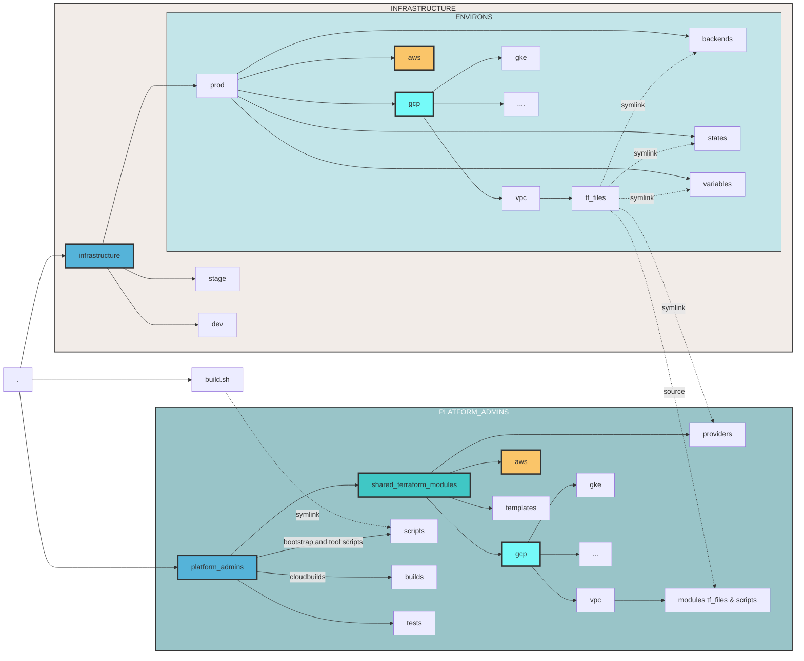

## Folder Structure

```mermaid
%%{init: { 'theme': 'default' } }%%
graph LR
classDef infra fill:#F2ECE8,stroke:#333,stroke-width:2px;
classDef admin fill:#99C4C8,color:#fff,stroke:#333,stroke-width:2px;
classDef environ fill:#C3E5E9,stroke:#333,stroke-width:1px;

.
infra[infrastructure]
style infra fill:#55B3D9,stroke:#333,stroke-width:3px
admin[platform_admins]
style admin fill:#55B3D9,stroke:#333,stroke-width:3px
sharedtf[shared_terraform_modules]
style sharedtf fill:#40C7C5,stroke:#333,stroke-width:3px

. --> build.sh -.->|symlink|scripts
. --> infra
. --> admin

subgraph PLATFORM_ADMINS
  admin --> sharedtf
  sharedtf --> gcpadmin[gcp]
  style gcpadmin fill:#75FAF9,stroke:#333,stroke-width:3px
  sharedtf --> awsadmin[aws]
  style awsadmin fill:#FAC569,stroke:#333,stroke-width:3px
  sharedtf --> providers
  sharedtf --> templates

  gcpadmin --> vpcadmin[vpc]
  gcpadmin --> gkeadmin[gke]
  gcpadmin --> ...

  vpcadmin --> tfadmin[modules tf_files & scripts]

  admin --> |bootstrap and tool scripts|scripts
  admin --> |cloudbuilds|builds
  admin --> tests

end

subgraph INFRASTRUCTURE
  infra --> prod
  infra --> stage
  infra --> dev
  subgraph ENVIRONS
    prod --> gcp
    style gcp fill:#75FAF9,stroke:#333,stroke-width:3px
    prod --> aws
    style aws fill:#FAC569,stroke:#333,stroke-width:3px
    prod --> backends
    prod --> states
    prod --> variables
    gcp --> vpc
    gcp --> gke
    gcp --> ....
    vpc --> tf[tf_files]
    tf -.->|source| tfadmin
    tf -.->|symlink| backends
    tf -.->|symlink| states
    tf -.->|symlink| providers
    tf -.->|symlink| variables
  end
end

class INFRASTRUCTURE infra
class PLATFORM_ADMINS admin
class ENVIRONS environ
```
