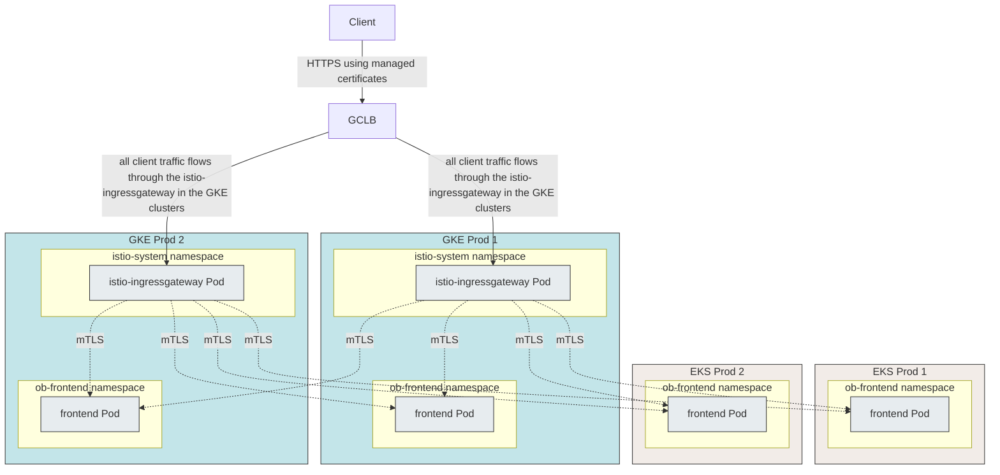

## Objective

1. Deploy a microservice based application to multiple clusters in multiple cloud environments using a CD pipeline.

## Videos

- [📽️ Video Walk Through I: Prerequisites and starting pipeline](https://app.threadit.area120.com/thread/e7xbr09np7402s136il4?utm_medium=referral-link)
- [📽️ Video Walk Through II: Accessing the application and inspecting CockroachDB](https://app.threadit.area120.com/thread/gnynsmqlti6kv3nek4si?utm_medium=referral-link)
- [📽️ Video Walk Through III: Inspecting CI/CD pipeline and metrics](https://app.threadit.area120.com/thread/bd3czy6h8x16gl6355bu?utm_medium=referral-link)
- [📽️ Video Walk Through IV: Migrating workloads using CI/CD pipelines](https://app.threadit.area120.com/thread/h9tox4iwnpcjkrxofcn5?utm_medium=referral-link)

## Prerequisites

1. Initialize the `config` repository. Follow the steps [here](/platform_admins/docs/init-config-repo.md). `config` repository ensures that the Online Boutique namespaces are created in all clusters in the `prod` environment.
1. Initialize the `shared-cd` repository. Follow the steps [here](/platform_admins/docs/init-shared-cd-repo.md). `shared-cd` repository contains the CI/CD jobs/stages required to deploy Online Boutique to the platform.
1. Ensure Cockroach DB is already deployed and two databases (`accountsdb` and `postgresdb`) are  created and hydrated. Follow the instructions [here](/platform_admins/docs/crdb.md).

## Multicloud Continuous Delivery

You intend to deploy an application called Bank of Anthos in your multicloud platform. [Bank of Anthos](https://github.com/GoogleCloudPlatform/bank-of-anthos) is a sample financial service application that simulates an online bank. The applications lets users create login accounts, login to their account, see their transaction history, allow users to make deposit to their account from a simulated external account and transfer money to other users' accounts. The application is composed of 7 services that each run as containers and connect to each other over REST and GRPC API. There is an 8th service called `loadenerator` which (as the name suggests) is used to simulate user load to the application. This is helpful when verifying functionality as well as looking at telemetry of the application.

You use Git to deploy the application. The source code for each service as well as the configuration needed to deploy and run the service are stored in Git repositories. In this workshop, you use Gitlab, however, you may use any Git solution for example Gitlab or Cloud Source Repositories. Once the source code and the services' configuration are stored in Git, CI workers (containers with the required tooling and access to the platform) are used to perform a series of steps to ensure that the application and its configuration is deployed in a consistent and repeatable manner. These series of steps can be automatically triggered by a user event. With Git, these events are when a user _commits_ something to the repository, when a user creates a _pull request_ or a _merge request_ and when that _pull/merge request_ is accepted. Different steps can be taken for each of these events depending upon the intent. This setup allows developers and application owners to continuously deploy applications without the need to coordinate with operations or by conducting any manual steps. These series of steps are themselves stored as code and are sometimes called CI/CD pipelines. CI (Continuous Integration) refers to the **building** of a deployable artifact. And CD (Continuous Delivery) refers to the **deployment** of the artifact along with its configuration. In this lab, you focus on CD. The artifacts for each service are containers that are already created and stored in a container repository.

Your goal is to deploy the containerized services along with their configuration to the multicloud platform.

At a high level you perform the following steps:

1. Initialize `config` and `shared-cd` repositories. See [Prerequisites](#prerequisites) for details.
1. Deploy CockroachDB. See [Prerequisites](#prerequisites) for details.
1. `bank-of-anthos` repository. Bank of Anthos is the application you aim to deploy in your multicloud platform. This repository contains the source code (in the `/src` folder) and the service configuration files (in the `/services` folder) required to deploy all services.
1. Run the Gitlab CI pipeline in the `bank-of-anthos` repo which generates hydrated Kubernetes manifest files for each service and commits them to the `config` repo in the appropriate service namespace.
1. Verify all Deployments are _Ready_.
1. Ensure Bank of Anthos is functioning by browsing through the app and performing all user actions.

## `bank-of-anthos` Repository

 `bank-of-anthos` repository is the application repository. This repository contains the source code (in the `/src` folder) as well as configuration files (in the `/services` folder) for all services.

### Deployment Pipeline

The deployment pipeline is defined in the `.gitlab-ci.yml` file. It consists of four stages:

1. **BuildContainers** Stage. This stage containerizes the application from the source code in the `src` folder for each service. This stage uses Cloudbuild to build the containers and stores the containerized artifacts in [Container Registry](https://cloud.google.com/container-registry) in the same project. You can view your containerized artifacts from the console by searching and navigating to the _Container Registry_ page in Cloud Console.
1. **BuildConfigs** Stage. This stage creates the _hydrated_ Kubernetes manifest files for all services. Hydrated Kubernetes configuration is a single file (called `${SVC}-hydrated.yaml`) that contains all resources required to run the service (deployment, service, ingress, service account etc.). This stage also creates a Cloud Ops [dashboard](https://cloud.google.com/monitoring/charts/dashboards) for the [golden signals](https://landing.google.com/sre/sre-book/chapters/monitoring-distributed-systems/) for each service. The script to create the dashboard as well as the dashboard template are located in the `/services/${SVC}/prod/monitoring` folder.
1. **CommitToConfigRepo** Stage. In this stage, the hydrated Kubernetes manifest files (created and outputted in the **BuildConfigs** stage) are committed to the `config` repository. There are seven services in the Bank of Anthos application. Each service gets deployed to its own namespace. The name of the namespace is the same as the service name prefixed by `boa-` for example the `frontend` service is deployed in the `boa-frontend` namespace. Each service namespace folder is under the `/namespaces/bank-of-anthos` folder in the `config` repository. The hydrtaed Kubernetes manifests files for each service is copied to the respective service namespace folders. For example, the `frontend-hydrated.yaml` file is copied to the `/namespaces/bank-of-anthos/frontend` folder. You access Bank of Anthos via the `frontend` service. This stage also securely exposes the `frontend` service so that you can access it over HTTPS. For HTTPS access to the frontend, you require a domain name and a certificate signed by a well-known CA (recognized by common browsers). You use [Cloud Endpoints](https://cloud.google.com/endpoints/docs/openapi/cloud-goog-dns-configure) to get a free DNS name for your application. With the Cloud Endpoints DNS name, you can use Google-managed SSL certificates service to get a free certificate for the frontend. By default, `frontend` Pods are deployed on all four clusters (two GKE and two EKS clusters). You use [Ingress for Anthos](https://cloud.google.com/kubernetes-engine/docs/concepts/ingress-for-anthos) to send all incoming traffic via the DNS name to the two `istio-ingressgateway` proxy Pods running on the two GKE clusters. `istio-ingressgateway` proxies are aware of all `frontend` Pods and load balance traffic to all available `frontend` Pods. The default load balancing mode is `ROUND ROBIN`. This is defined in the `destinationrule--frontend.yaml` (located in the `/services/frontend/templates` folder). 

1. **SetupWorkloadIdentity** Stage. Each service runs with a [Kubernetes Service Account](https://kubernetes.io/docs/tasks/configure-pod-container/configure-service-account/). The service account name is the same as the service name. For example, the `frontend` service runs in the `boa-frontend` namespace with the `frontend` service account. You can think of the Kubernetes Service Account as the service identity. Each service writes metrics to [Cloud Ops](https://cloud.google.com/products/operations). You need to authenticate and authorize services to write metrics data to Cloud Ops. Services running in GKE (on GCP) can use [Workload Identity](https://cloud.google.com/kubernetes-engine/docs/how-to/workload-identity). With Workload Identity, you can configure a Kubernetes service account to act as a Google service account. As part of the workshop build pipeline, a GCP service account called `cloud-ops` is created with proper IAM roles to write metrics data to Cloud Ops. All services running on GKE (on GCP) use Workload Identity with the `cloud-ops` service account. This allows GKE services to write metrics data to Cloud Ops.

The `.gitlab-ci.yml` pipeline runs every time a commit is made to the `bank-of-anthos` repository.

1. Run the following commands to initialize the `bank-of-anthos` repository.

```bash
cd ${WORKDIR}
git clone git@gitlab.endpoints.${GOOGLE_PROJECT}.cloud.goog:bank-of-anthos/bank-of-anthos.git
cd $WORKDIR/bank-of-anthos
cp -r ${WORKDIR}/anthos-multicloud-workshop/platform_admins/starter_repos/bank_of_anthos/. .
git add .
git commit -m "initial commit"
git branch -m master main
git push -u origin main
```

## Deployment Pipeline

Every time you commit to the `bank-of-anthos` repository, you can view the pipeline by accessing the following link. You can also navigate to the same link by clicking on the **CI/CD > Pipelines** link from the left hand nav bar.

```bash
echo -e "https://gitlab.endpoints.${GOOGLE_PROJECT}.cloud.goog/bank-of-anthos/bank-of-anthos/-/pipelines"
```

Wait until the pipeline successfully completes.


You can click on individual jobs to view details.

## Viewing Workloads

After the pipeline successfully completes, click on the following link to get the workloads (i.e. Deployments) for the Bank of Anthos application.

```bash
echo -e "https://console.cloud.google.com/kubernetes/workload?project=${GOOGLE_PROJECT}&pageState=(%22savedViews%22:(%22i%22:%223290aa8deba342dfaddb85d65a7ab6ba%22,%22c%22:%5B%5D,%22n%22:%5B%22boa-accounts-db%22,%22boa-balancereader%22,%22boa-contacts%22,%22boa-frontend%22,%22boa-ledger-db%22,%22boa-ledgerwriter%22,%22boa-loadgenerator%22,%22boa-transactionhistory%22,%22boa-userservice%22%5D))"
```

Each service for the Bank of Anthos gets deployed in its own namespace. The link above creates a view in the **Kubernetes Engine > Workloads** page with all of the Bank of Anthos services' namespaces selected.


Ensure all workloads are _Ready_. Refresh the screen until all workloads are healthy.

## Secure Ingress

The deploy pipeline creates an implementation of multi-cloud ingress using Ingress for Anthos for the Bank of Anthos application. This creates a DNS name for the `frontend` service (using Cloud Endpoints) and a Google-managed certificate.

1. Check that the managed certificate is proivisioned and `ACTIVE` by running the following command:

```bash
gcloud compute ssl-certificates list
```

The output looks like the following:
```
Output (Do not copy)
NAME                                     TYPE     CREATION_TIMESTAMP             EXPIRE_TIME                    MANAGED_STATUS
bank-of-anthos-ingress-ssl-certificate  MANAGED  2020-10-17T10:00:38.627-07:00  2021-01-15T08:07:06.000-08:00  ACTIVE
    bank.endpoints.gcp_project_id.cloud.goog: ACTIVE
```

2. Once the certificate is `ACTIVE`, you can access the Bank of Anthos application by navigating to the following link:

```bash
echo -e "https://bank.endpoints.${GOOGLE_PROJECT}.cloud.goog"
```

You can now navigate through the application and perform actions like depositing cash into your account and transfering money to other accounts. You can also create new user accounts, log in and start a transaction log.

> If you get the error `ERR_SSL_VERSION_OR_CIPHER_MISMATCH` when accessing the frontend, wait a few moments and then try again.

The traffic flow is diagrammed below:



1. Client accesses Bank of Anthos via a DNS name. In this workshop, the DNS name is provided by Cloud Endpoints, however, you can use any DNS name of a domain you own.
1. A Google-managed SSL certificate is used for HTTPS access to Bank of Anthos.
1. GCLB sends the traffic to the two `istio-ingressgateway` proxy Pods running in the two GKE clusters. You can control how much load goes to each backend (i.e. `istio-ingressgateway`) using the [RATE](https://cloud.google.com/load-balancing/docs/https#load_distribution_algorithm) setting.
1. Each `istio-ingressgateway` is aware of all `frontend` Pods. By default, `frontend` Pods are deployed to all four clusters. `frontend` is divided into two subsets - one for GCP and one for AWS. Subsets group workloads based on labels. All workloads (Pods) running GKE contain the label `provider: gcp` while all workloads running in EKS contain the label `provider: aws`. Using label selectors, the two subsets (one for Pods running in GCP and the other for Pods running in AWS) are created as part of the **BuildConfigs** pipeline. You can then use a `VirtualService` CRD to control how much traffic you want to send to each subset. by default, the traffic is equally split between the two subsets.
1. From `client` to `frontend`, all traffic is encrypted. TLS between client and `istio-ingressateway` and mTLS between `istio-ingressgateway` and the `frontend` Pods.

Congratulations. You have successfully deployed a microservice-based application to the Anthos multi-cloud platform using a simple Continuous Delivery (CD) pipeline.

#### [Back to Labs](/README.md#labs)
