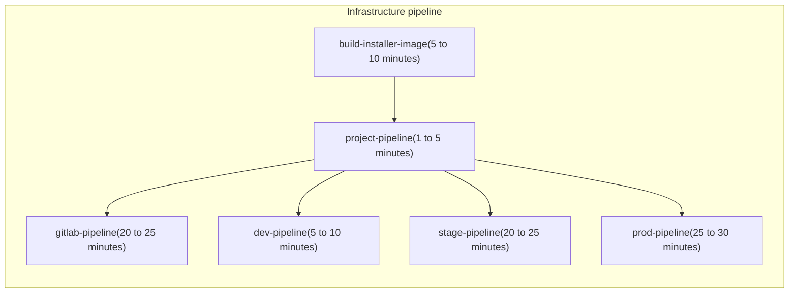
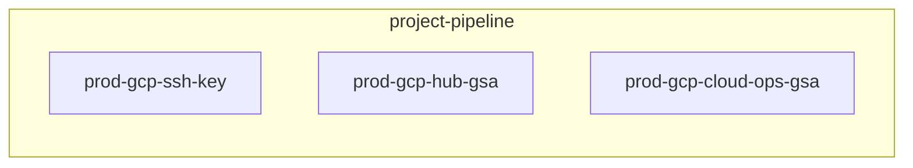
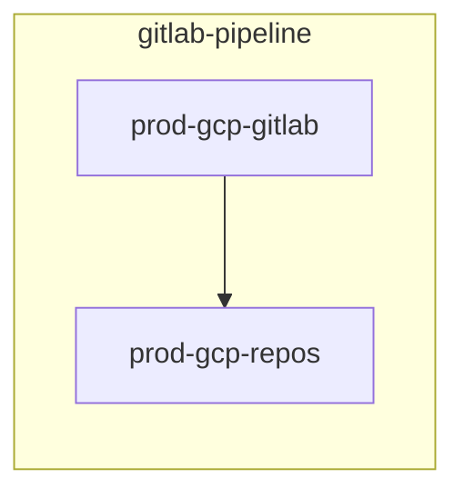
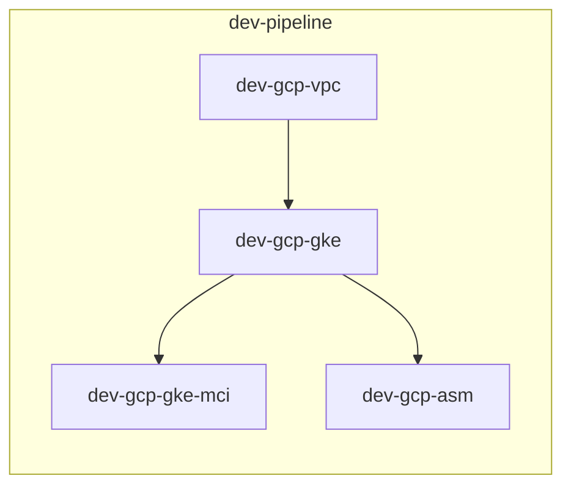
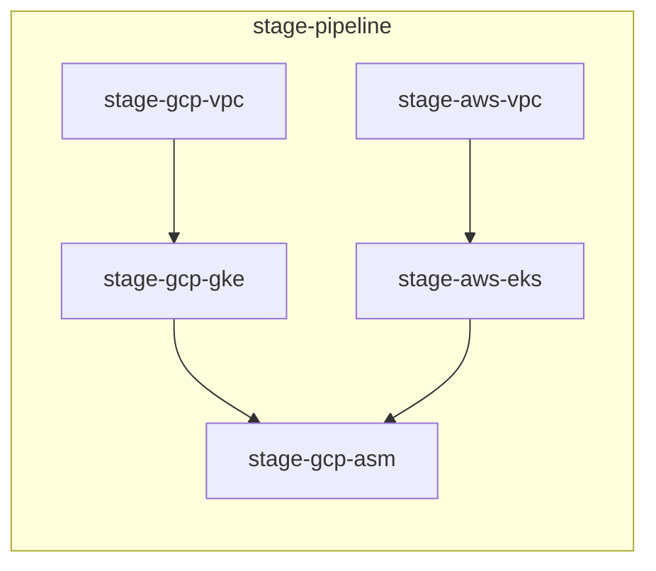
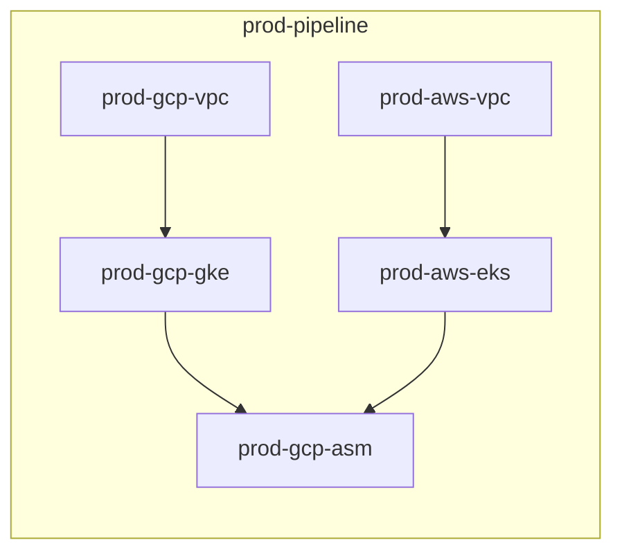

# Pipelines

## Infrastructure pipeline

The infrastructure pipeline is controlled by the [`cloudbuild.yaml`](../builds/cloudbuild.yaml) in the `infrastructure` Cloud Source Repository(CSR) `main` branch. The Cloud Build trigger, configured by the [`bootstrap.sh`](../scripts/bootstrap.sh) script, will start a build any time there is a push to the `infrastructure` CSR `main` branch.

The `build-installer-image` is the first step; once it completes, the `project-pipeline` starts. Upon completion of the `project-pipeline`, the remaining steps started in parallel.

1. **build-installer-image**  
   The `build-installer-image` step creates a container image, using this [Dockerfile](../../Dockerfile), which is used in the sequential steps. The container image is based on the Google Cloud SDK image and has additional tools installed, namely Terraform, aws-iam-authenticator, kubectl, kpt, and kustomize.
1. **project-pipeline**  
   The `project-pipeline` step submits a Cloud Build for the project pipeline using the [`cloudbuild-project.yaml`](../builds/cloudbuild-project.yaml) at `platform_admins/builds/cloudbuild-project.yaml` in the `infrastructure` CSR `main` branch. This pipeline uses Terraform in the `platform-installer` image to generate SSH keys and create service accounts; for more information, see the [project-pipeline documentation](#project-pipeline)
1. **gitlab-pipeline**  
   The `gitlab-pipeline` step submits a Cloud Build for the GitLab pipeline using the [`cloudbuild-gitlab.yaml`](../builds/cloudbuild-gitlab.yaml) at `platform_admins/builds/cloudbuild-gitlab.yaml` in the `infrastructure` CSR `main` branch. This pipeline uses Terraform in the `platform-installer` image to deploy GitLab and create the necessary repositories; for more information, see the [gitlab-pipeline documentation](#gitlab-pipeline)
1. **dev-pipeline**  
   The `dev-pipeline` step submits a Cloud Build for the development pipeline using the [`cloudbuild-dev.yaml`](../builds/cloudbuild-dev.yaml) at `platform_admins/builds/cloudbuild-dev.yaml` in the `infrastructure` CSR `main` branch. This pipeline uses Terraform in the `platform-installer` image to deploy and configure the development environment; for more information, see the [dev-pipeline documentation](#dev-pipeline)
1. **stage-pipeline**  
   The `stage-pipeline` step submits a Cloud Build for the project pipeline using the [`cloudbuild-stage.yaml`](../builds/cloudbuild-stage.yaml_tmpl) at `platform_admins/builds/cloudbuild-project.yaml` in the `infrastructure` CSR `main` branch. This pipeline uses Terraform in the `platform-installer` image to deploy and configure the staging environment; for more information, see the [stage-pipeline documentation](#stage-pipeline)
1. **prod-pipeline**  
   The `prod-pipeline` step submits a Cloud Build for the project pipeline using the [`cloudbuild-project.yaml`](../builds/cloudbuild-prod.yaml_tmpl) at `platform_admins/builds/cloudbuild-prod.yaml` in the `infrastructure` CSR `main` branch. This pipeline uses Terraform in the `platform-installer` image to deploy and configure the production environment; for more information, see the [prod-pipeline documentation](#prod-pipeline)

---

### project-pipeline

The project infrastructure build is started after the **build-installer-image** step completes in the [Infrastructure pipeline](#infrastructure-pipeline).

The **project-pipeline** uses Terraform to creates and deploys the following resources by default:

- 1 x SSH key
- 1 x Hub GSA
- 2 x Cloud Ops GSA

1. **prod-gcp-ssh-key**  
   Generate an SSH key for Anthos Config Management(ACM); for additional information see the [module and documentation](../../infrastructure/prod/gcp/ssh_key/)
1. **prod-gcp-hub-gsa**  
   Create a Hub service account adn assign it the `roles/gkehub.connect` role; for additional information see the [module and documentation](../../infrastructure/prod/gcp/hub_gsa/)
1. **prod-gcp-cloud-ops-gsa**  
   Create a Cloud Ops service account and assign it the `roles/logging.logWriter`, `roles/monitoring.metricWriter`, and `roles/monitoring.viewer`; for additional information see the [module and documentation](../../infrastructure/prod/gcp/cloud_ops_gsa/)

---

### gitlab-pipeline

The GitLab infrastructure build is started after the `project-pipeline` step completes in the [Infrastructure pipeline](#infrastructure-pipeline).

The **gitlab-pipeline** uses Terraform to creates and deploys the following resources by default:

- 1 x GitLab
- 2 x GitLab repositories

1. **prod-gcp-gitlab**  
   Deploys GitLab; for additional information see the [module and documentation](../../infrastructure/prod/gcp/gitlab/)
1. **prod-gcp-repos**  
   Creates necessary repositories in GitLab; for additional information see the [module and documentation](../../infrastructure/prod/gcp/repos/)

---

### dev-pipeline

The development environment's infrastructure build is started after the `project-pipeline` step completes in the [Infrastructure pipeline](#infrastructure-pipeline).

The **dev-pipeline** uses Terraform to creates and deploys the following resources by default:

- 1 x GCP VPC
- 2 x GKE clusters
- MultiClusterIngress(MCI)
- Anthos Service Mesh(ASM)

1. **dev-gcp-vpc**  
   Create and configure a VPC on GCP; for additional information see the [module and documentation](../../infrastructure/dev/gcp/vpc/)
1. **dev-gcp-gke**  
   Create and configure a GKE cluster on GCP; for additional information see the [module and documentation](../../infrastructure/dev/gcp/gke/)
1. **dev-gcp-gke-mci**  
   Enable MCI; for additional information see the [module and documentation](../../infrastructure/dev/gcp/mci/)
1. **dev-gcp-asm**  
   Deploy ASM; for additional information see the [module and documentation](../../infrastructure/dev/gcp/asm/)

---

### stage-pipeline

The staging environment's infrastructure build is started after the `project-pipeline` step completes in the [Infrastructure pipeline](#infrastructure-pipeline).

The **stage-pipeline** uses Terraform to creates and deploys the following resources by default:

- 1 x GCP VPC
- 1 x AWS VPC
- 1 x GKE cluster
- 1 x EKS cluster
- Anthos Service Mesh(ASM)

1. **stage-gcp-vpc**  
   Create and configure a VPC on GCP; for additional information see the [module and documentation](../../infrastructure/stage/gcp/vpc/)
1. **stage-aws-vpc**  
   Create and configure a VPC on AWS; for additional information see the [module and documentation](../../infrastructure/stage/aws/vpc/)
1. **stage-gcp-gke**  
   Create and configure a GKE cluster on GCP; for additional information see the [module and documentation](../../infrastructure/stage/gcp/gke/)
1. **stage-aws-eks**  
   Create and configure an EKS cluster on AWS; for additional information see the [module and documentation](../../infrastructure/stage/aws/eks/)
1. **stage-asm**  
   Deploy ASM; for additional information see the [module and documentation](../../infrastructure/stage/gcp/asm/)

---

### prod-pipeline

The production environment's infrastructure build is started after the `project-pipeline` step completes in the [Infrastructure pipeline](#infrastructure-pipeline).

The **prod-pipeline** uses Terraform to creates and deploys the following resources by default:

- 1 x GCP VPC
- 1 x AWS VPC
- 2 x GKE clusters
- 2 x EKS clusters
- Anthos Service Mesh(ASM)

1. **prod-gcp-vpc**  
   Create and configure a VPC on GCP; for additional information see the [module and documentation](../../infrastructure/prod/gcp/vpc/)
1. **prod-aws-vpc**  
   Create and configure a VPC on AWS; for additional information see the [module and documentation](../../infrastructure/prod/aws/vpc/)
1. **prod-gcp-gke**  
   Create and configure a GKE cluster on GCP; for additional information see the [module and documentation](../../infrastructure/prod/gcp/gke/)
1. **prod-aws-eks**  
   Create and configure an EKS cluster on AWS; for additional information see the [module and documentation](../../infrastructure/prod/aws/eks/)
1. **prod-asm**  
   Deploy ASM; for additional information see the [module and documentation](../../infrastructure/prod/gcp/vpc/)
