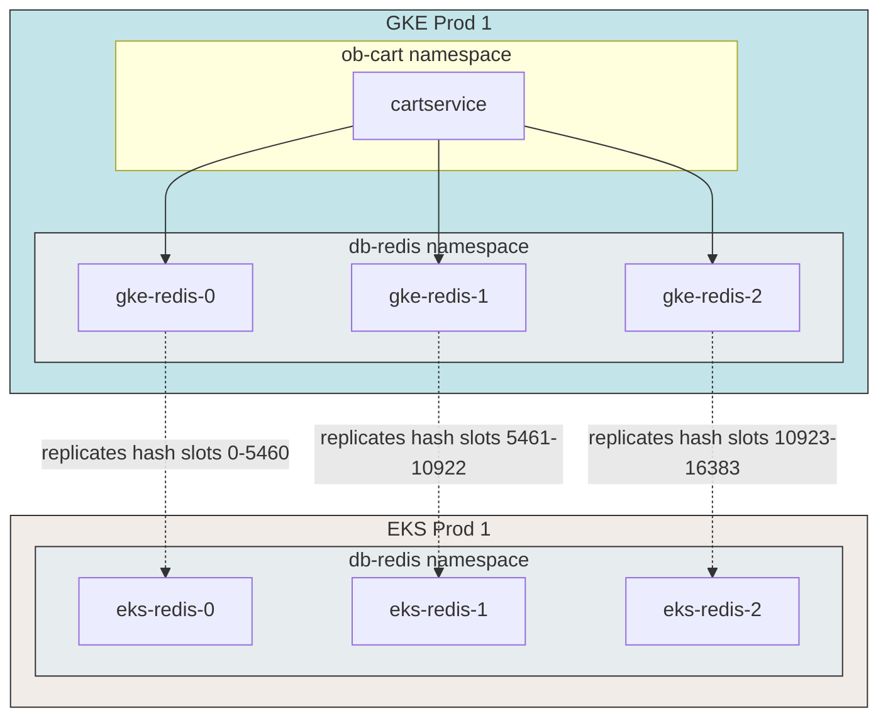

## Objective

1. Set up a multicloud Redis cluster with three primary (or master) nodes running in GKE and three replica (or slave) nodes running in an EKS cluster. This is used by the `cart` service in the Online Boutique application.



## Prerequisites

1. Initialize the `config` repository. Follow the steps [here](/platform_admins/docs/init-config-repo.md). `config` repository ensures that the `db-redis` namespace is created in all clusters in the `prod` environment. You only have to perform this step once. If you have already done so, you can skip this step.
1. Initialize the `shared-cd` repository. Follow the steps [here](/platform_admins/docs/init-shared-cd-repo.md). `shared-cd` repository contains the CI/CD jobs/stages required to deploy Redis to the platform. You only have to perform this step once. If you have already done so, you can skip this step.

## Redis

[Redis](redis.io) is an open source in-memory key-value datastore. You can deploy Redis in a multicloud platform in a number of ways. One of these ways is to deploy redis as a [cluster](https://redis.io/topics/cluster-spec). A Redis cluster consists of one or more primary nodes and one or more corresponding replica nodes. In a multi-primary Redis cluster, the primary nodes divide the [hash slots](https://redis.io/topics/data-types-intro) amongst themselves. There are 0 - 16383 hash slots. So in a three node Redis cluster, each node takes ownership of approximately 5640 hash slots.

You can deploy Redis inside Kubernetes or outside Kubernetes. In the Anthos multicloud platform, you deploy a 3 node Redis cluster each with 1 replica node in Kubernetes clusters. The 3 primary nodes are deployed in a GKE cluster and their replicas are deployed in an EKS cluster as [StatefulSets](https://kubernetes.io/docs/concepts/workloads/controllers/statefulset/). You can learn more about deploying Redis on GKE clusters [here](https://rancher.com/blog/2019/deploying-redis-cluster).

## `redis` Repository

1. Initialize the `config` and `shared-cd` repositories. See the [Prerequisites](#prerequisites) section above for details.

1. Run the following commands to create a `redis` repository where all of the configuration files reside.

```bash
source ${WORKDIR}/anthos-multicloud-workshop/user_setup.sh
cd ${WORKDIR}
# init git
git config --global user.email "${GCLOUD_USER}"
git config --global user.name "Cloud Shell"
if [ ! -d ${HOME}/.ssh ]; then
  mkdir ${HOME}/.ssh
  chmod 700 ${HOME}/.ssh
fi
# pre-grab gitlab public key
ssh-keyscan -t ecdsa-sha2-nistp256 -H gitlab.endpoints.${GOOGLE_PROJECT}.cloud.goog >> ~/.ssh/known_hosts
git clone git@gitlab.endpoints.${GOOGLE_PROJECT}.cloud.goog:databases/redis.git
cd ${WORKDIR}/redis
cp -r ${WORKDIR}/anthos-multicloud-workshop/platform_admins/starter_repos/redis/. .
git add .
git commit -m "initial commit"
git branch -m master main
git push -u origin main
```

Upon committing to the `redis` repo, a CI/CD pipeline is triggered which deploys the Redis cluster on `$GKE_PROD_1` (3 primary nodes) and `$EKS_PROD_1` (three replica nodes) clusters.

1. You can view the CI/CD pipeline by navigating to the output of the following link.

```bash
echo -e "https://gitlab.endpoints.${GOOGLE_PROJECT}.cloud.goog/databases/redis/-/pipelines" 
```

1. Wait until the pipeline finishes successfully.

1. Run the following command to verify that Redis cluster is properly created.

```bash
kubectl --context=${GKE_PROD_1} -n db-redis exec -it gke-redis-0 -- redis-cli cluster nodes
```

Output (Do not copy)

```
1abf9848685eb9f6b159d4b5a0d7f827eb297066 240.0.0.11:6379@16379 slave 6d6a3ddc32f2c8ad069c299b24d2a5e3d63bbb6d 0 1604876627582 1 connected
13e3b23359f74e0473b8dab44809497d9a38fcd8 240.0.0.21:6379@16379 master - 0 1604876626000 2 connected 5461-10922
c8c04e23bdf02345fdd0495eec1d896d65238924 240.0.0.22:6379@16379 slave 1e5be7edf0e218626d95cf84e4471a60e3557145 0 1604876625542 7 connected
6d6a3ddc32f2c8ad069c299b24d2a5e3d63bbb6d 240.0.0.20:6379@16379 myself,master - 0 1604876625000 1 connected 0-5460
cdbe0345d0e399ecacdd13bd6703940ab419fffa 240.0.0.12:6379@16379 slave 13e3b23359f74e0473b8dab44809497d9a38fcd8 0 1604876626000 2 connected
1e5be7edf0e218626d95cf84e4471a60e3557145 240.0.0.10:6379@16379 master - 0 1604876626580 7 connected 10923-16383
```

You see 6 nodes. There are three primary nodes (labeled `master`) with IP addresses 240.0.0.20, 21 and 22 and three replica nodes (labeled `slave`) with IP addresses 240.0.0.10, 11 and 12. You can see the hash slot for each primary node. For example, in the output above the primary node 240.0.0.20 has slots `0-5460`, node with IP 240.0.0.21 has slots `5461-10922` and node with IP 240.0.0.22 has slots `10923-16383`.

#### [Back to Online Boutique application deployment](platform_admins/docs/multicluster-cd-online-boutique.md)

#### [Back to Labs](/README.md#labs)